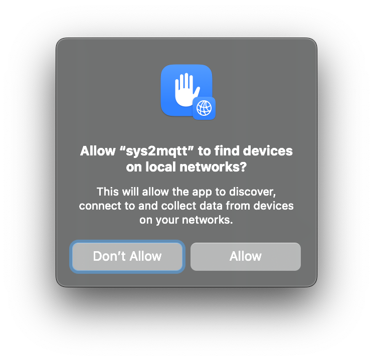
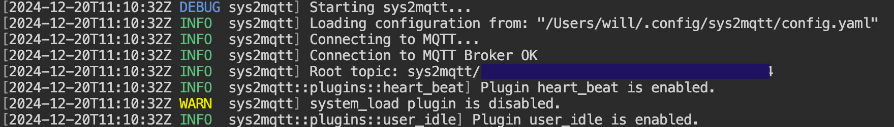
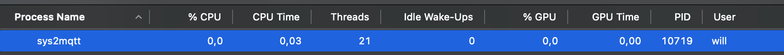
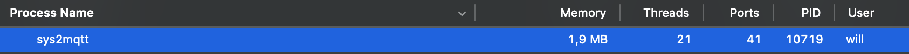
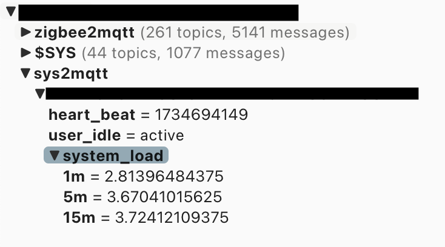

# sys2mqtt

Sends system information to an MQTT broker.

Primarily developed and tested on MacOS but changes are it should work or be closed to working on Linnux and maybe
Windows. PR are welcome for Linux/Windows whether regarding the code or simply the documentation.

Most of the configuration can be done via the configuration file called `config.yaml`.
If running in debug mode, `config.yaml` is expected to be local. Otherwise, it is expected to be under
`$HOME/.config/sys2mqtt/config.yaml`.

Some of the information cannot be configured via the configuration file: credentials. If needed those, must come  from
the environment variables `MQTT_USERNAME` and `MQTT_PASSWORD`.

## Installation

Installing the binary using `cargo` or the pre-built binary is trivial.
However, getting the binary to run as an Agent is more challenging.

While eveything required to hack around is availabe in the repo (see `justfile`), I suggest using the `install.sh`
script.

The rest of the documentation assumes you installed using `cargo` and the binary is installed under `$HOME/.cargo/bin/sys2mqtt`.

### `install.sh` script

First let's run the installer:

```sh
curl -sSL https://raw.githubusercontent.com/chevdor/sys2mqtt/refs/heads/master/install.sh | sh
```

You will be prompted to allow local network access, without that, `sys2mqtt` will not be able to reach your MQTT broker *when running as an Agent* (it would work if you call the binary manually, but you then need to start the binary yourself every time you boot up your machine)



### Using cargo
```
cargo install sys2mqtt
```

### Precompiled binary

A pre-compiled binary can be found at https://github.com/chevdor/sys2mqtt/releases/tag/v0.1.0

### From source

If that's your option, you likely know how it goes:
```
git clont https://github.com/chevdor/sys2mqtt
cd sys2mqtt
cargo run
```

## Usage

The first version is rather simple and the command does not support any argument.
If you have no configuration file, the first run will generate a default one for you.
The configuration file is expected to be under `$HOME/.config/sys2mqtt/config.yaml` and should be self explanatory.

Before starting `sys2mqtt`, make sure you have a running MQTT broker. Running `mosquitto` will start one locally and you
may confirm using `mosquitto_sub -v -t "#`.

You may want to monitor the output of the command to get started. It looks like:



An important piece of information is the `Root topic` which is used to publish the information. The root topic looks
like: `sys2mqtt/112376B0-BB5C-78DF-BFF8-42C6E4AABA4`

You may now subscribe to the root topic to get the information:
```
mosquitto_sub -v -t "sys2mqtt/112376B0-BB5C-78DF-BFF8-42C6E4AABA4/#"
```

`sys2mqtt` by default should not report data very often so you may need to wait a minute or two to start seeing changes.
You may tweak the configuration to increase/decrese the frequency of the updates.

`sys2mqtt` requires very little cpu and memory as can be seen below:



### Launch as daemon (MacOS)

You probably do not want to start `sys2mqtt` manually every time.
There is no magic installer for now so there is a bit of manual work.


## Available metrics

All the following metrics will show up under the root topic: `sys2mqtt/<SOME_UID>`.


- `heart_beat`: a timestampt to ensure that `sys2mqtt` is "still there"
- `user_idle`: `active` or `idle`
- `system_load`:
    - `1m`: CPU load over the last 1m
    - `5m`: CPU load over the last 5m
    - `15m`: CPU load over the last 15m
