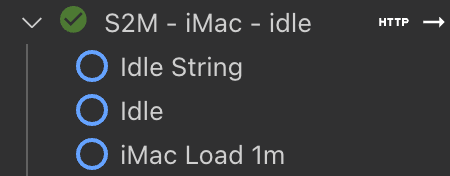
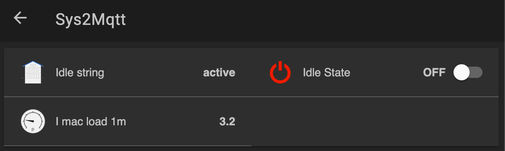
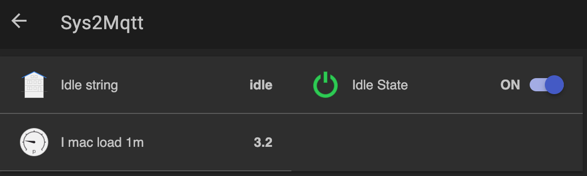
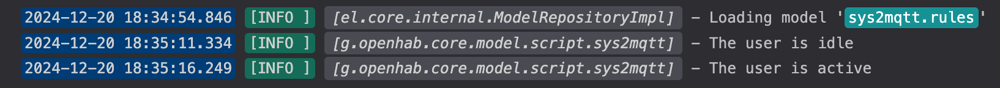

## OpenHab

While you may use `sys2mqtt` in totally unrelated context, I initially developed it to be used with
[OpenHab](https://www.openhab.org/) and the MQTT Binding. If you don't have MQTT or the Binding, you may check the following [documentation](https://community.openhab.org/t/oh3-mqtt-setup-and-configuration/111494).

This mini guides assumes you already have a MQTT Broker running, you know its `host`, `port`, `username` & `password` (if
needed). This allowed you setting up a `Thing`. Let's call it `mqtt:broker:_MosquittoBroker`.

We will now create new `Things` for `sys2mqtt` in a file called (for instance): `things/sys2mqtt.things`.

The first information you will need is the `UID` for the machine(s) running `sys2mqtt`.
it will be easy to spot when using `MQTT Explorer` or using the following command:

First let's define some VAR specific to your system:
```
HOST=somehost
PORT=1883
MQTT_USERNAME=openhabian
MQTT_PASSWORD=somepass
```

The following command should now works:
```
mosquitto_sub -h $HOST -p $PORT -u $MQTT_USERNAME -P $MQTT_PASSWORD -v -t "sys2mqtt/#"
```

Depending on your config, you may need to wait up to 1 minute so see some output.
You will then likely see something like:
```
sys2mqtt/<SOME_LONG_UID>/heart_beat 1734714109
```

where SOME_LONG_UID looks like `112376B0-BB5C-78DF-BFF8-42C6E4AABA4`
Make note of this `UID`, you will need it in a second.

We also need to pick one metric from [Metrics](metrics.md). We will ne using `user_idle` and `system_load/1m` as examples.
In the following example, the `UID` will be mentioned as `<UID>`, make sure to adjust accordingly and use the `UID`
matching your machine.

Here is a sample `Thing` file for OpenHab:
```
Thing mqtt:topic:_MosquittoBroker:imac_idle "S2M - iMac - idle" (mqtt:broker:_MosquittoBroker) @ "Office" {
    Channels:
        Type string : idle_string "Idle String" [
            stateTopic="sys2mqtt/<UID>>/user_idle" ]

        Type switch: idle "Idle" [
            stateTopic="sys2mqtt/<UID>>/user_idle",
            on="idle", off="active" ]

        Type number : system_load_1m "iMac Load 1m" [
            stateTopic="sys2mqtt/<UID>>/system_load/1m" ]
}
```

I am not sure we really need the idle state both as `string` and `switch` (I would probably use `swicth` only) but that
makes a nice example :)

If you are using the VSCode / OpenHab extension, you should soon see our new `S2M - iMac - idle` thing:



We can see that no `item` currently use our 3 channels. Let's fix that. I created a `items/sys2mqtt.items` file:

```
String    iMac_Idle__String      "Idle string"             <presence>    (Sys2Mqtt)    {channel="mqtt:topic:_MosquittoBroker:imac_idle:idle_string"}
Switch    iMac_Idle__Switch      "Idle State"                            (Sys2Mqtt)    {channel="mqtt:topic:_MosquittoBroker:imac_idle:idle"}
Number    iMac_SystemLoad__1m    "I mac load 1m [%.1f]"    <pressure>    (Sys2Mqtt)    {channel="mqtt:topic:_MosquittoBroker:imac_idle:system_load_1m"}
```
After some renaming and formatting, assuming you created already a group called `Sys2Mqtt` and added it to you sitemap, you should see something like:




Let's now add a simple rule to react when the user is "idle". In our example, it will just show a log entry but OpenHab
makes it super simple to turn on/off some lights, or do anything you'd like.

In a file called `rules/sys2mqtt.rules`, let's add:
```
rule "Add a log entry when the user is idle"
when
    Item iMac_Idle__Switch changed
then
    if (iMac_Idle__Switch.state == ON) {
        logInfo("sys2mqtt", "The user is idle")
    } else {
        logInfo("sys2mqtt", "The user is active")
    }
end
```



I am personally still experimenting but let me share my `user_idle` config:
```
user_idle:
  enabled: true
  delay: 5
  timeout: 15
```
This configuration means that `sys2mqtt` will check whether the user is idling or not every `5s`. The thread dedicated to
`user_idle` will sleep the rest of the time.
If the user was idle more than `15s`, the `user_idle` metric will turn from `active` to `idle`. Once the user is active
again, it will take up to `5s` for OpenHab to be notified.

Those values are rather short and if your rule turns ON/OFF a light, it will become very annoying very quick :)
An option in that case is to modify our items and use a debounce profile:
```
Switch    iMac_Idle__Switch      "Idle State"                            (Sys2Mqtt)    {channel="mqtt:topic:_MosquittoBroker:imac_idle:idle" [profile="basic-profiles:debounce-time", toItemDelay=60000, mode="LAST"]}
```
Here for instance, we will ignore the information about the user going `idle` unless it has been as such for more than
60'000 ms = 1 minute and "bounces" between idle/active within 60s will be filtered out.

### Questions/feedback

If you have questions, want to provide feedback or drop a word, you may head towards [this
post](https://community.openhab.org/t/sys2mqtt-send-system-metrics-from-your-computer-to-mqtt/161010).
